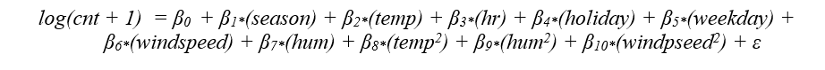
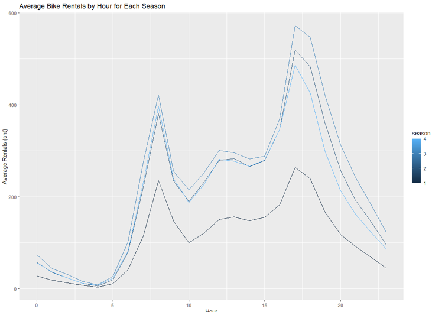

# Capital Bike Sharing Data Analysis

## About
This project analyzes bike-sharing data to uncover trends, correlations, and predictive insights into rental patterns. The analysis includes exploratory data analysis, data cleaning, visualization, regression modeling, and evaluation of statistical assumptions, with a focus on understanding the relationship between environmental factors and bike rentals.

---

## Tools & Technologies
- **Programming Language**: R
- **Libraries**:
  - Data manipulation: `dplyr`, `tidyverse`
  - Data visualization: `ggplot2`, `GGally`
  - Statistical modeling: `caret`, `broom`, `lmtest`, `car`
  - Diagnostics: `Hmisc`, `sandwich`
- **Software**: RStudio for script development and analysis.

---

## Features
### **1. Exploratory Data Analysis (EDA)**
- **Summary Statistics**:
  - Computed summary statistics for rental counts and other variables.
- **Correlations**:
  - Generated a correlation matrix to identify relationships between variables.
  - Identified multicollinearity issues and addressed them.
- **Data Cleaning**:
  - Created new variables (e.g., `temp_diff` for temperature differences).
  - Transformed categorical variables into factors for analysis.

### **2. Data Visualization**
- Scatter plots, box plots, and line graphs for exploring relationships between variables:
  - **Temperature vs. Bike Rentals**.
  - **Seasonal and Hourly Trends**.
  - **Bike Demand by Weather and Working Days**.
- Heatmaps for visualizing correlations between variables.
- Marginal effect plots for understanding the impact of temperature and humidity.

### **3. Regression Modeling**
- Developed multiple regression models to predict bike rentals (`cnt`):
  - Included polynomial terms for non-linear relationships.
  - Evaluated model assumptions and corrected for violations:
    - Multicollinearity: Removed redundant variables (e.g., `atemp`, `yr`, `mnth`).
    - Heteroskedasticity: Applied log transformations.
    - Non-linearity: Used polynomial terms.
  - Performed diagnostics such as residual plots, Q-Q plots, and Durbin-Watson tests.

### **4. Model Evaluation**
- Split data into training, validation, and test sets.
- Compared models using:
  - Root Mean Squared Error (RMSE).
  - R-squared and Adjusted R-squared.
- Stepwise regression for model selection.
- Evaluated the marginal effects of temperature and humidity on rental counts.

### **5. Business Insights**
- **Key Variables**:
  - Temperature: Strong positive correlation with bike rentals, but diminishing marginal returns.
  - Hour of Day: Significant impact on rental counts, with peak demand during certain hours.
  - Humidity: Negative effect on rentals at higher levels.
  - Weather Conditions: Clear weather results in higher demand compared to adverse conditions.
- **Recommendations**:
  - Optimize bike availability during peak hours and favorable weather conditions.
  - Target promotions for off-peak seasons to balance demand.

---

## Some Key Visualizations

### Final Regression Equation


### Bike Rentals Per Season


---

## Results
- **Best Model**: A multiple regression model incorporating polynomial terms for `temp`, `hum`, and `windspeed`.
- **Evaluation Metrics**:
  - Training RMSE: `0.913`
  - Validation RMSE: `0.897`
  - Test RMSE: `0.904`
- **Key Findings**:
  - Marginal effects of temperature and humidity diminish as values increase.
  - Seasonal and hourly trends significantly influence bike rental patterns.

---

## Key Code Snippet:

### Correlation Analysis**
```R
correlation_matrix <- bike_data |>
  select_if(is.numeric) |>
  cor()
correlations_with_cnt <- correlation_matrix["cnt", ] |>
  sort(decreasing = TRUE)
print(correlations_with_cnt)

